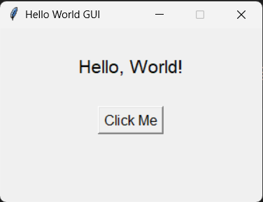

# Hello World GUI

**Level:** 01 — Beginner (GUI Basics)

## What It Does
A simple Tkinter window with a label and a button. Clicking the button updates the label text — this is your first taste of GUI event handling in Python.

## Concepts Covered
- Creating a Tkinter root window (`tk.Tk()`)
- Setting window title and size (`.title()`, `.geometry()`)
- Widgets: `Label`, `Button`
- Layout with `.pack()`
- Event handling with the `command` parameter
- Updating a widget dynamically with `.config()`

## How to Run
```bash
python main.py
```

## Screenshot

