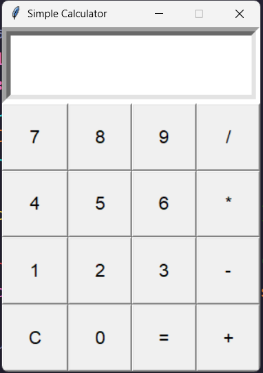

# Simple Calculator

**Level:** 01 — Beginner (GUI Basics)

## What It Does
A basic four-function calculator (add, subtract, multiply, divide) built with Tkinter's grid layout system. Click digits and operators to build an expression, then press `=` to evaluate it, or `C` to clear.

## Concepts Covered
- `.grid(row=, column=)` layout — precise widget placement vs `.pack()`
- `Entry` widget for display/input
- `sticky="nsew"` to make widgets fill their grid cell
- `grid_columnconfigure` / `grid_rowconfigure` for responsive resizing
- Avoiding the lambda closure bug in loops (`lambda t=text: ...`)
- Basic use (and risk) of `eval()` for expression evaluation

## ⚠️ A Note on `eval()`
This project uses `eval()` to keep things simple while learning. `eval()` executes whatever string is passed to it as Python code, which is **unsafe for real-world apps** taking input from untrusted users. In a later, more advanced project, this will be replaced with a safer expression parser.

## How to Run
```bash
python main.py
```

## Screenshot
